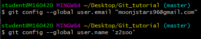

# Git 기초 
> Git은 분산형 버전 관리 시스템(DVCS)
> 소스코드의 이력을 확인하고, 협업 단계에서 활용 가능


## 0. 기본 설정
윈도우에서 Git을 활용하기 위해서는 Git bash 필요 [설치링크](https://gitforwindows.org/)
설치 이후에 commit을 작성하는 author 설정 필요

```bash
$ git config --global user.email "github user email"
$ git config --global user.name 'github user name'
```




# 로컬 저장소에서 활용하기
## 1. Git 저장소 설정

특정 프로젝트 폴더에서 Git을 활용하기 위해서는 아래의 명령어를 입력

```bash
$ git init
Initialized empty Git repository in C:/Users/student/Desktop/git/.git/
```

* 해당 디렉토리 내에 `.git`이라는 숨김 폴더가 생성되며, 모든 Git 관련 동작은 해당 폴더에 기록됨
* git bush 에서 하늘색 (master) 라는 브랜치 정보가 보여짐


## 2. add

Git에서 commit할 대상 파일을 `staging area`로 이동시키는 명령어

```bash
$ git add a.txt #특정 파일을 stage
$ git add images/ #특정 폴더를 stage
$ git add . #모든 디렉토리 stage
```

* add 전 상태

```bash
$ touch a.txt
$ touch b.txt
$ ls
a.txt  b.txt

$ git status
On branch master
No commits yet
Untracked files:
  (use "git add <file>..." to include in what will be committed)
        a.txt
        b.txt
nothing added to commit but untracked files present (use "git add" to track)
```


* add 후 상태

```bash
$ git add a.txt
$ git status
On branch master
No commits yet
Changes to be committed: #commit될 변경 사항
  (use "git rm --cached <file>..." to unstage)
        new file:   a.txt
Untracked files:
  (use "git add <file>..." to include in what will be committed)
        b.txt
```

**항상 `git status` 명령어를 통해 현재 상태를 확인하는 것이 중요! **


## 3. commit

Git에서 이력을 남기기 위해서는 `commit`을 통해서 진행

`commit`을 남길 때에는 항상 커밋 메세지(변경 사항에 대한 설명)를 작성할 것

```bash
$ git commit -m 'Add files'
[master 22cc213] Add files
 1 file changed, 0 insertions(+), 0 deletions(-)
 create mode 100644 b.txt
```


커밋 이력을 확인하기 위해서는 다음 명령어를 사용

* log

```bash
$ git log
commit 22cc213e62772f177e6f300a32814486a47e32fa (HEAD -> master)
Author: z2soo <moonjstars96@gmail.com>
Date:   Mon Dec 9 14:27:29 2019 +0900
    Add files
commit ceb6e8b2409ce9c9a83fc0c2f9e181afe754430b
Author: z2soo <moonjstars96@gmail.com>
Date:   Mon Dec 9 14:26:14 2019 +0900
    Add files
```


* status

이후 변경 사항이 발생하게 된다면, `add` -> `commit`을 사용

```bash
$ git status
On branch master
nothing to commit, working tree clean
```


* add: 커밋할 대상 파일 선정

* commit: 이력의 확정(스냅샷을 찍는 것)


# 원격 저장소(remote repository) 활용하기

> 원격 저장소를 제공해주는 서비스는 다양함
>
> 우리는 github을 기준으로 활요할 것 


## 0. 기본 설정

Github에 비어 있는 저장소(repository) 생성


## 1. 원격 저장소 설정

```bash
$ git remote add origin http://~
```

원격 저장소(remote)를 `origin`이라는 이름으로 `https://~`로 설정함

아래의 명령어를 통해 저장된 원격 저장소 목록 확인 가능

```bash
$ git remote -v
```

혹시 설정이 잘못되었다면, 아래의 명령어를 통해 삭제 가능

``` bash
$ git remote rm origin
$ git remote -v
```


## 2. push

원격 저장소에 업로드하기 위해서는 `push` 명령어 필요

`origin`으로 설정된 원격 저장소에 `push` 실행

```bash
$ git push origin master 
```

이후에 변경된 사항(`commit`)이 발생하였을 때, `git push origin master` 명령어를 통해서 매번 업로드 필요 

한번에 여러개 업로드 가능, 새로운 `commit`발생 시에만 가능


# Visual studio code

> 프로젝트 진행시, git으로 관리하지 않을 파일 설정 가능
>
> R.history와 같이 해당 소스코드 자체가 아닌 파일


## 1. 프로그램 설치

프로그램 설치 시, 모든 사항에 대해 체크

[visual studio code](https://code.visualstudio.com/docs/?dv=win)


## 2. gitignore 설정

visual studio code 프로그램 실행 > new file > .gitignore 이름 설정 > 내용담기

프로젝트 시작시, 어떤 내용을 담아야 하는지 모르겠다면 아래 사이트에서 검색 가능

[gitignore](http://gitignore.io/)

* python, R, jupyternotebook에 대한 내용 작성